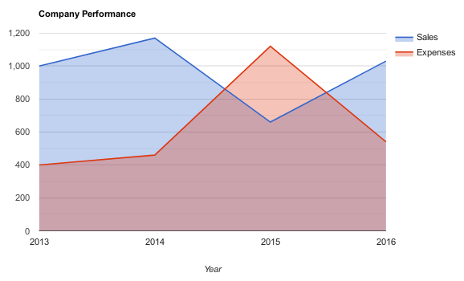
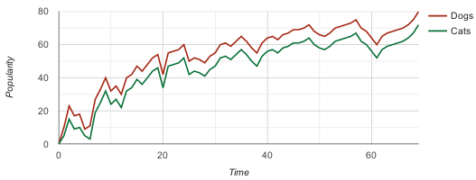
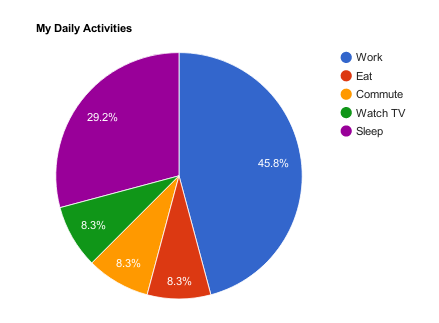

# desafio_html_persistencia_google_charts

Utilizando os recursos disponíveis no Google Charts criou-se uma aplicação Java que gera um arquivo .HTML com os dados do gráfico apartir de valores informados pelo usuário.

Neste simples programa é possível criar três tipos de gráficos (imagens abaixo) diferentes através das informações que o usários
insere ao executá-lo.

Area Charts:    

Line Charts:    

Pie Charts:    

